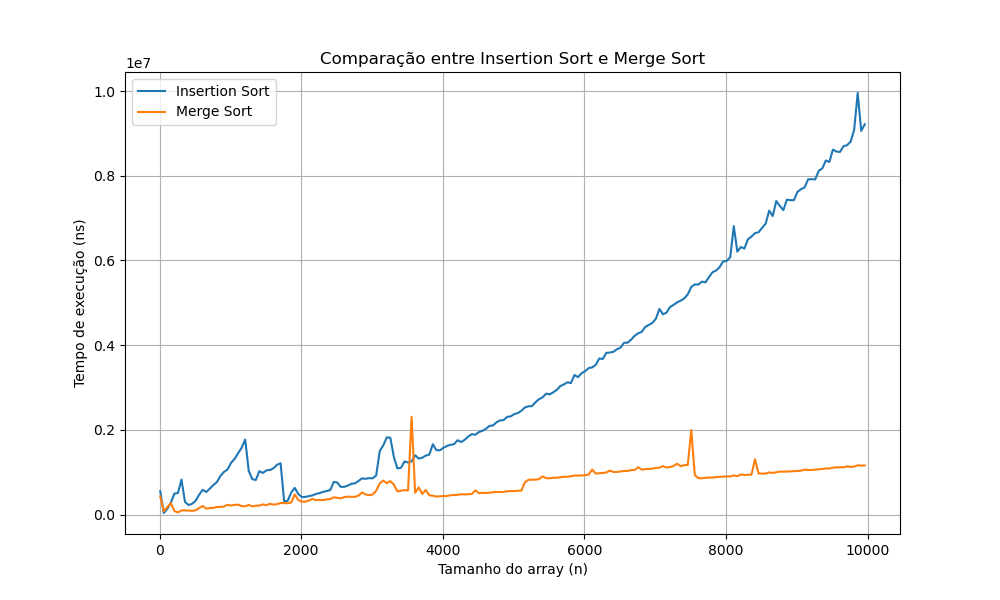

# 📊 Análise de Algoritmos: Insertion Sort vs Merge Sort

<h1 align="center">🔍 Projeto de Análise de Algoritmos</h1>
<p align="center">
  <i>Comparação empírica entre Insertion Sort e Merge Sort</i> 🚀
</p>

---

## 📋 Sobre o Projeto
**Disciplina:** Projetos e Análise de Algoritmos  
**Professor:** Danilo  
**Desenvolvido por:** João Marcello Machado Braz  

Projeto que implementa e compara os algoritmos de ordenação:
- **Insertion Sort** (O(n²)) - Simples, eficiente para pequenos conjuntos
- **Merge Sort** (O(n log n)) - Eficiente para grandes volumes de dados

---

## 🎯 Objetivos
✔ Implementar ambos algoritmos em Java  
✔ Medir desempenho para entradas de 10 a 100.000 elementos  
✔ Gerar visualizações comparativas em Python  
✔ Validar complexidades teóricas na prática  
✔ Responder aos questionamentos propostos  

---

## 🛠️ Stack Tecnológica
<div align="center">
  
  
  
  
  
  
  
</div>

---

## 🔬 Análise Comparativa

### 📊 Resultados Obtidos
<div align="center">
  
</div>

### ❓ Questionamentos Respondidos

| Pergunta | Resposta | Insights |
|----------|----------|----------|
| **Confirmação teórica** | ✅ Sim | Insertion Sort mostra crescimento quadrático, Merge Sort exibe comportamento O(n log n) |
| **Ponto de virada** | 📌 n ≈ 50-70 | Merge Sort se torna mais eficiente a partir deste tamanho |
| **Dados parcialmente ordenados** | 🔄 Vantagem Insertion | Pode atingir O(n) no melhor caso |
| **Superioridade absoluta?** | ⚠️ Não | Insertion é melhor para n < 30 ou dados quase ordenados |

---

## 🖥️ Execução do Projeto

```bash
# 1. Clonar repositório
git clone https://github.com/Joaomarcellodev/analise-algoritmos.git
cd analise-algoritmos

# 2. Compilar e executar (Java)
javac src/*.java
java -cp src App > results.csv

# 3. Configurar ambiente Python
python -m venv venv
source venv/bin/activate  # Linux/Mac
venv\Scripts\activate    # Windows
pip install -r requirements.txt

# 4. Gerar visualização
python plot.py
